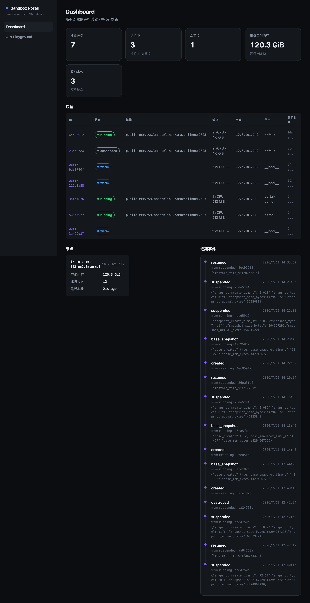
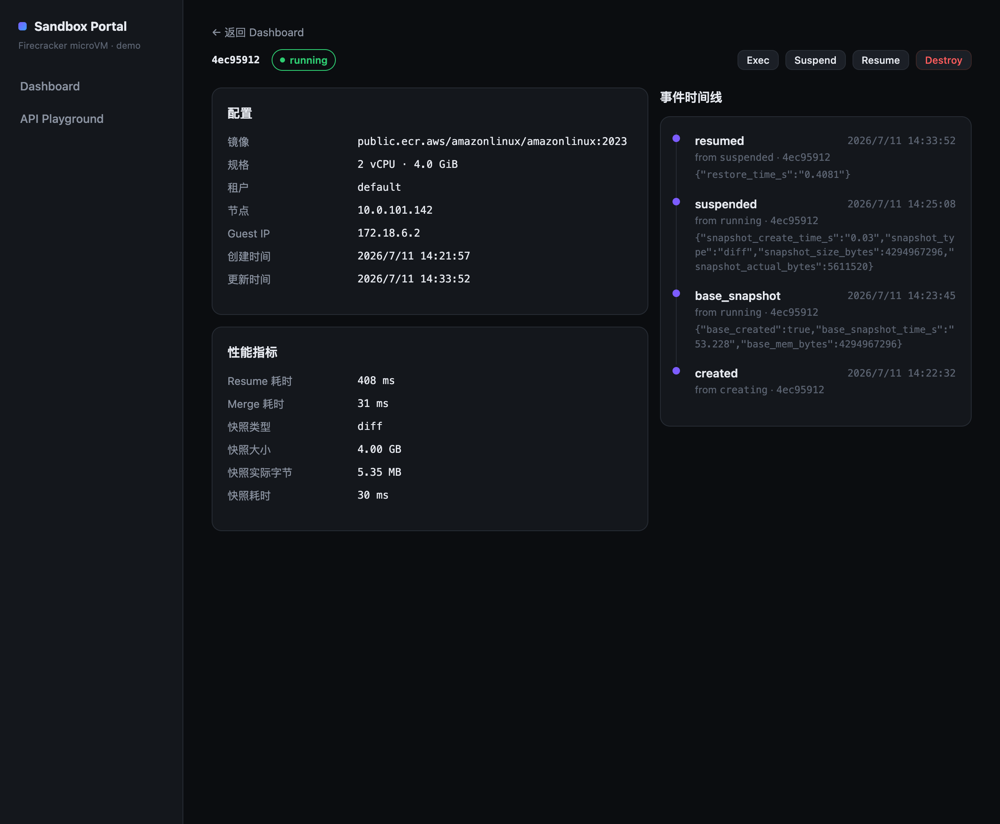

# AWS Self-Hosted AI Agent Sandbox Platform

> Build your own Fly.io-style Firecracker microVM sandbox on AWS — lower cost, full control, data stays in your account.

[中文 / Chinese](README.md) · **English**

---

### Overview

A production-grade AI Agent sandbox platform built on AWS, replicating Fly.io's Firecracker microVM architecture — with lower cost, full data sovereignty, and a Kubernetes-managed platform control plane.

- **True microVM isolation**: Each sandbox runs in an independent Firecracker guest kernel — identical behavior to bare metal
- **Host-managed Firecracker backend**: node-agent orchestrates TAP, snapshots, and API calls, while host systemd + jailer run every VMM in an independent cgroup/chroot. Snapshots land on persistent state EBS and are uploaded to S3 by default (configurable).
- **Separated control and data planes**: the control plane stays on On-Demand Graviton system nodes; Firecracker runs only on tainted sandbox nodes, using either bare-metal hosts or nested-virtualization-capable Intel x86 instances (`i7i.8xlarge` is the current default); see the [heterogeneous node-pool E2E report](docs/控制面数据面分离-i7i真机测试报告-2026-08-11.md)
- **Snapshot-driven cost control**: Idle sandboxes snapshot to persistent EBS, resume in ~1.2s (same-node)
- **Fly Machines-style API**: create/wait/suspend/resume/exec/locate with idempotency, optimistic locking, capability model
- **Port exposure & dev tooling**: reach any in-VM port via `/s/{id}/{port}` (path routing, WebSocket-capable), interactive web terminal, file upload/download — all through the Portal (see API section below)
- **Custom images**: `image` field selects a prebuilt named rootfs template (e.g. `web` = demo site auto-served on :80); see [docs/自定义rootfs设计.md](docs/自定义rootfs设计.md)
- **Zero credentials in sandboxes**: Bedrock credentials live only in LiteLLM Pod's IRSA role
- **Platform observability**: low-cardinality Prometheus metrics, centralized JSON logs in CloudWatch, cross-component OpenTelemetry/X-Ray traces, five alert classes, an eight-panel dashboard, SHA-256 snapshot verification, AMP remote-write, and automated AMG configuration

### Use Cases

| Use Case | Description |
|---|---|
| **Claude Code** | fork/exec-heavy, file-watch-intensive, nested processes — microVM guarantees bare-metal fidelity |
| **OpenClaw / Hermes** | Conversational agents needing multi-tenant isolation and autoscaling |
| **OpenAI Codex / Code-gen Agents** | Arbitrary code execution with VM-level security boundary |
| **Long-horizon Agentic Tasks** | Pause/resume workflows, snapshot session state mid-task |
| **SaaS Sandbox Service** | Expose isolated execution to end users, multi-tenant, usage-based billing |
| **CI/CD Sandboxes** | Isolated build/test environments with full OS access |

### Portal (Demo Dashboard)

A lightweight E2B / Fly.io-style console ([`portal/`](portal/)) for demoing and observing the platform:
a global overview of all sandboxes, node capacity, warm-pool level and an event timeline, plus an API
Playground to run create / suspend / resume / exec / destroy and see each call's response and latency live.
**Runs locally** (`npm run dev` + `kubectl port-forward`); see [portal/README.md](portal/README.md).

| Dashboard Overview | Sandbox Detail + Metrics |
|---|---|
|  |  |

> Screenshots from a live deployment (EKS + c6g.metal): summary cards, sandbox table with status badges,
> node capacity, event timeline; the detail page shows the full record plus snapshot/resume performance
> metrics (e.g. a diff snapshot writing only 5.35 MB, resume in 408 ms).

### Comparison with Alternatives

| Feature | This (AWS Self-Hosted) | E2B | Fly.io Machines | AWS AgentCore |
|---|---|---|---|---|
| **Isolation** | Firecracker microVM | Firecracker microVM | Firecracker microVM | Container (shared kernel) |
| **Bare-metal fidelity** | ✅ Highest | ✅ High | ✅ High | ❌ Container behavior gaps |
| **Custom images** | ✅ Named rootfs templates (prebuilt) | ✅ | ✅ | ❌ Restricted |
| **Arbitrary port exposure** | ✅ Path routing `/s/{id}/{port}` + shared NLB (WebSocket supported) | ✅ | ✅ | ❌ |
| **Interactive web terminal / file transfer** | ✅ Built into Portal (PTY-over-WS + base64 over exec) | ✅ | Partial | ❌ |
| **24×7 persistent** | ✅ | ✅ | ✅ | ❌ TTL enforced |
| **Snapshot suspend/resume** | ✅ 1.2s measured | ✅ | ✅ | ❌ |
| **Auto-sleep / auto-wake** | ✅ Idle → `slept`; gateway request transparently resumes (opt-in via `autostop`/`autostart`) | ✅ | ✅ auto_stop/auto_start | ❌ |
| **Credential isolation** | ✅ LiteLLM IRSA (verified) | ✅ | ✅ | N/A |
| **Observability** | ✅ Prometheus/Alertmanager/Grafana; optional AMP + AMG | Managed | Managed | CloudWatch |
| **Data sovereignty** | ✅ Stays in your AWS account | ❌ 3rd party | ❌ 3rd party | ✅ |
| **K8s ecosystem** | Platform services run on EKS; sandboxes are not Pods | ❌ | ❌ | ❌ |
| **Min. monthly cost (2 system + 1 sandbox node)** | **~$751/mo target** (sandbox Spot + On-Demand system) | Managed pricing | Managed pricing | Per-call |

#### Auto-sleep / auto-wake (fly.io-style)

Idle sandboxes snapshot themselves to a distinct `slept` state (freeing RAM); the next request hitting the gateway `/s/{id}/{port}/` transparently resumes them (~0.13s) — no user action needed.

- **Opt-in, off by default** — reuses Fly's `services[].autostop` / `autostart` fields (or `meta.auto_sleep` / `auto_wake`). Sandboxes that don't declare them are unaffected.
- **Auto-sleep (`slept`) vs manual suspend (`suspended`) are strictly separated** — only `slept` is auto-woken by the gateway; a manually `suspended` sandbox is never resumed by a request.
- **Activity signals**: gateway HTTP traffic and `exec` refresh `last_active_at` (in-memory throttled to avoid write amplification).
- Reuses the same `lease + conditional-write + rollback` concurrency guard as manual suspend; scan loop is leader-gated (shares the reconcile/warm-pool leader lock) and re-checks idleness after acquiring the lease to avoid racing a fresh request.
- Tunables: `AUTO_SLEEP_ENABLED` / `AUTO_SLEEP_IDLE_S` (default 300s) / `AUTO_SLEEP_SCAN_S` / `AUTO_WAKE_TIMEOUT_S` / `ACTIVITY_TOUCH_MIN_S`. Implementation in `sandbox-api/autosleep.py`; e2e in `scripts/autosleep_e2e.sh`. Real-machine verified 2026-07-16 (see `docs/自动休眠-真机测试报告-2026-07-16.md`).

### Why a Sandbox Is Not a Pod

Kubernetes manages the **platform services**, not each user's execution environment. Ingress, the API
control plane, LiteLLM, and node-agent run as Pods. User code runs inside Firecracker microVMs that
node-agent starts as host processes on the sandbox nodes. In short: **Kubernetes schedules the managers;
the sandbox control plane schedules the microVMs.**

For a create request, `sandbox-control-plane` selects a data node from node-agent heartbeats and remaining
capacity, writes the sandbox state to DynamoDB, and calls that node's node-agent. The node-agent prepares
the rootfs, TAP network, and vsock, assigns vCPU and memory, and starts Firecracker. kube-scheduler sees
one node-agent DaemonSet Pod per data node; each sandbox has a lightweight CRD identity but no matching
Pod, PVC, or Service.

| Dimension | Regular Pod | Firecracker sandbox in this project |
|---|---|---|
| Kubernetes identity | Each instance is a Pod, usually created by a Deployment, Job, or another controller | Each sandbox is a lightweight CRD backed by DynamoDB state; no matching Pod exists |
| Placement | kube-scheduler uses requests, affinity, taints, and other cluster policies | The control plane selects a sandbox node from node-agent heartbeats, free memory, and VM count |
| Isolation boundary | Containers use namespaces and cgroups and normally share the node kernel | KVM supplies a virtual hardware boundary; every microVM boots its own guest kernel |
| Lifecycle | kubelet pulls an image, starts containers, and recreates them according to Pod policy | node-agent calls Firecracker APIs for create, snapshot, suspend, resume, and destroy |
| Networking | CNI assigns a Pod IP; Services and Ingress route to the Pod | Each guest uses its own TAP `/30`; traffic follows `Ingress → control plane → node-agent → guest` |
| Stateful data | Commonly attached through PV/PVC resources coordinated by Kubernetes | Each sandbox has its own rootfs and memory snapshots on the host-mounted persistent state EBS volume |
| Observability | `kubectl`, Pod conditions, probes, and container logs expose the workload directly | Kubernetes sees node-agent only; the platform must report VM state, snapshot latency, and guest health |
| Scale unit | A user environment normally adds at least one Pod and related API objects | One node-agent manages many microVMs without mapping sandbox count directly to Kubernetes object count |

This split gives long-lived, suspendable environments a lifecycle that is not defined by Pod recreation.
An idle sandbox can write a Firecracker snapshot, release VMM memory, and later continue from the same
guest state. The node can also pack workloads according to their real working sets. Kubernetes still
handles replicas, rolling updates, service discovery, and failover for the platform components.

The trade-off is that the platform must implement capabilities Kubernetes would otherwise provide:
placement, the instance state machine, network proxying, health checks, garbage collection, and recovery.
The current implementation also has two important boundaries:

- Newly created or resumed VMMs run as host-owned `sbx-vmm-<id>.service` units, outside the node-agent
  Pod cgroup. During the first upgrade, old VMMs still use the legacy Pod cgroup and must be
  checkpointed/drained before replacing node-agent. Roll out phase3 host helpers and jailer first.
- Same-AZ recovery now includes EBS takeover, OD standby restore, repatriation to an empty Spot node,
  old-volume cleanup, and exact OD scale-down. Cross-AZ failure still requires S3 or another cross-AZ
  authority. These runtime/auth/recycle changes have local regression coverage but have not yet been
  revalidated by a destructive FIS run on upgraded nodes.

### Architecture

```
┌─ EKS cluster ─────────────────────────────────────────────────────────┐
│                                                                       │
│  system node group (On-Demand)   sandbox data node group             │
│  Graviton m7g (2 by default)     c6g.metal or i7i.*                  │
│  ┌───────────────────────────┐    ┌────────────────────────────────┐ │
│  │ sandbox-control-plane     │HTTP│ node-agent Pod (DaemonSet)     │ │
│  │ (2 replicas, IRSA)        │───►│ hostNetwork / privileged       │ │
│  │ FirecrackerDriver         │◄───│ heartbeat / tap / snapshots    │ │
│  │ WarmPool + Reconciler     │ HB ├────────────────────────────────┤ │
│  │ Stateless → DynamoDB      │    │ Host Firecracker processes     │ │
│  └───────────────────────────┘    │  ├ microVM A (not a Pod)       │ │
│                                   │  ├ microVM B (not a Pod)       │ │
│                                   │  └ microVM N (not a Pod)       │ │
│                                   └────────────────────────────────┘ │
│  CoreDNS / LiteLLM / Ingress     taint: dedicated=sandbox           │
│       ↑ ingress-nginx (NLB)      (no ordinary Pods on data nodes)   │
│       api.sbx.<domain> (POC: use port-forward)                       │
│                                                                       │
│  DynamoDB: sandboxes / events / tap-idx / nodes / locks             │
│  Prometheus / Alertmanager / Grafana ──SigV4 remote-write──► AMP    │
│                                                    AMG ──PrivateLink─┘│
│  Fluent Bit ──► CloudWatch Logs    OTLP ──► ADOT ──► X-Ray          │
└───────────────────────────────────────────────────────────────────────┘
```

### Observability

`observability.tf` and `p2_observability.tf` support four deployment levels:

1. `enable_observability_stack=true` installs in-cluster Prometheus, Alertmanager, and Grafana,
   and discovers the control plane and node-agent automatically.
2. `enable_amp_remote_write=true` creates an AMP workspace and configures Prometheus IRSA +
   SigV4 remote-write. Level 1 must also be enabled.
3. Supplying an existing AMG workspace, VPC, subnets, and security group grants minimum AMP query
   permissions and creates an `aps-workspaces` Interface Endpoint. Terraform does not create AMG.
4. `enable_p2_observability=true` deploys Fluent Bit/CloudWatch Logs and ADOT/X-Ray, then uses a
   15-minute AMG token to upsert the datasource and dashboard. Temporary credentials are deleted.

The stack includes five alert classes (wake latency, snapshot integrity, capacity, orphan growth,
and control-plane degradation) plus the eight-panel `Sandbox Platform` dashboard. Metrics do not
use sandbox IDs as labels. Snapshot restore verifies a SHA-256 manifest and rejects corrupted state.

The real AWS test also found the same correlation ID in control-plane and node-agent CloudWatch
logs, reconstructed their parent/child trace in X-Ray, verified AMG datasource health `OK`, and
left zero temporary AMG accounts. See [deployment Step 6.2](docs/deploy.md#step-62-部署可观测性p1推荐)
and the [P2 observability E2E report](docs/P2可观测性-真机测试报告-2026-08-12.md).

### Quick Start (Agent Deployment Guide)

> Copy the following to Claude Code, Cursor, or any code-capable Agent to deploy the platform end-to-end.

```
You are a DevOps engineer deploying an AI Agent sandbox platform on AWS.
Follow these steps exactly, debugging any errors before proceeding.

[Prerequisites]
- AWS CLI configured (IAM permissions: EKS, EC2, IAM, DynamoDB, ECR, S3)
- kubectl, terraform(>=1.5), helm, git installed
- EC2 vCPU quota for the selected sandbox host (`c6g.metal`=64, `i7i.8xlarge`=32)

[Step 0: Clone the repository]
git clone https://github.com/teaguexiao/aws-self-hosted-sandbox.git
cd aws-self-hosted-sandbox
export AWS_REGION=us-east-1

[Step 1: Create DynamoDB state tables]
cd terraform/stage1-dynamodb
terraform init && terraform apply -auto-approve
aws dynamodb list-tables --region us-east-1 | grep claude-sbx

[Step 2: Create EKS cluster + separated system and sandbox node groups]
cd ../phase3
MY_IP=$(curl -s https://checkip.amazonaws.com)
# Choose one:
NODE_ARCH=arm64; SANDBOX_INSTANCE_TYPE=c6g.metal
# NODE_ARCH=amd64; SANDBOX_INSTANCE_TYPE=i7i.8xlarge
terraform init && terraform apply -auto-approve \
  -var="node_arch=${NODE_ARCH}" \
  -var="sandbox_instance_type=${SANDBOX_INSTANCE_TYPE}" \
  -var="endpoint_public_access_cidrs=[\"${MY_IP}/32\"]"
aws eks update-kubeconfig --name claude-sbx --region us-east-1
kubectl wait node --all --for=condition=Ready --timeout=900s

# phase3 creates an On-Demand arm64 system group and a dedicated sandbox group.
# node_arch describes only the sandbox group; the system group remains arm64 On-Demand.

[Step 5: Build and push matching-architecture images]
# Note: the sandbox image repo claude-sbx is auto-created by phase3 (Step 2); only create these two:
ACCT=$(aws sts get-caller-identity --query Account --output text)
aws ecr create-repository --repository-name sandbox-control-plane --region us-east-1 2>/dev/null || true
aws ecr create-repository --repository-name node-agent --region us-east-1 2>/dev/null || true
NODE_AGENT_PLATFORM=$([ "$NODE_ARCH" = "amd64" ] && echo linux/amd64 || echo linux/arm64)
bash scripts/build_and_push.sh \
  --control-plane-platform linux/arm64 \
  --node-agent-platform "$NODE_AGENT_PLATFORM"

[Step 6: Deploy control plane + node-agent + LiteLLM]
# FC_NODES: internal IPs of stable sandbox nodes
# sandbox_domain is the subdomain root; control plane will be at api.<sandbox_domain>
cd terraform/stage2-control-plane && terraform init
ACCT=$(aws sts get-caller-identity --query Account --output text)
S3_BUCKET="my-sandbox-snapshots-${ACCT}"
aws s3 mb s3://${S3_BUCKET} --region us-east-1 2>/dev/null || true
FC_NODES=$(kubectl get nodes -l sandbox=true \
  -o jsonpath='{range .items[*]}{.status.addresses[?(@.type=="InternalIP")].address}{","}{end}' | sed 's/,$//')
API_KEY=$(openssl rand -hex 32)
LITELLM_KEY=$(openssl rand -hex 32)
NODE_AGENT_AUTH_SECRET=$(openssl rand -hex 32)
terraform apply -auto-approve \
  -var="fc_nodes=${FC_NODES}" \
  -var="sandbox_image=public.ecr.aws/amazonlinux/amazonlinux:2023" \
  -var="control_plane_image=${ACCT}.dkr.ecr.us-east-1.amazonaws.com/sandbox-control-plane:latest" \
  -var="node_agent_image=${ACCT}.dkr.ecr.us-east-1.amazonaws.com/node-agent:latest" \
  -var="snapshot_s3_bucket=${S3_BUCKET}" \
  -var="enable_fargate=false" \
  -var="create_ingress_nginx=false" \
  -var="sandbox_domain=sbx.example.com" \
  -var="api_keys=${API_KEY}" \
  -var="node_agent_auth_secret=${NODE_AGENT_AUTH_SECRET}" \
  -var="litellm_master_key=${LITELLM_KEY}"
# Terraform creates: IRSA roles, K8s resources (sandbox-system namespace +
# control-plane Deployment + node-agent DaemonSet), api-keys Secret + ConfigMap.

[Step 8: Configure DNS for production API access]
NLB_HOST=$(kubectl get svc -n ingress-nginx ingress-nginx-controller \
  -o jsonpath='{.status.loadBalancer.ingress[0].hostname}')
echo "Add DNS record: api.sbx.example.com CNAME $NLB_HOST"
# Or skip DNS and use --resolve flag for testing (see Step 9)

[Step 9: Run end-to-end tests]
# Wait for image pull to complete (ECR first pull ~1-3 min)
kubectl rollout status deployment/sandbox-control-plane -n sandbox-system --timeout=300s
kubectl rollout status deployment/litellm -n litellm --timeout=300s

# Tip: LiteLLM defaults to 4Gi memory + 1 replica (configured in litellm.tf to prevent OOMKill).
# If it still OOMKills: kubectl set resources deployment/litellm -n litellm --limits=cpu=2,memory=4Gi
# Tip: single-node cluster — if the 2nd LiteLLM replica stays Pending (anti-affinity):
#   kubectl scale deployment/litellm -n litellm --replicas=1
# Tip: if terraform reports "Unexpected Identity Change" on a deployment resource:
#   terraform state rm kubernetes_deployment.litellm kubernetes_deployment.control_plane
#   then re-run terraform apply

kubectl get pods -n sandbox-system   # control-plane 2/2 on system nodes + node-agent on sandbox nodes
kubectl get pods -n litellm           # litellm 1/1

# ── Recommended: local port-forward mode (no DNS/Ingress; measured ALL TESTS PASSED) ──
bash scripts/e2e_test.sh --api-key "$API_KEY"
# Expected: script ends with ALL TESTS PASSED (some tests skip depending on driver)

# ── Production Ingress (optional) ──
# POC accesses the control plane via kubectl port-forward (no ingress-nginx installed).
# For real external access, install ingress-nginx / AWS Load Balancer Controller and
# expose the control-plane Service; then use --resolve for local testing against the NLB:
# NLB_IP=$(dig +short $NLB_HOST | head -1)
# bash scripts/e2e_test.sh --api-url "http://api.sbx.example.com" --resolve "api.sbx.example.com:80:${NLB_IP}"

[Step 10: Use the API]
BASE_URL="http://api.sbx.example.com"   # or http://localhost:18000

# Create sandbox (idempotent)
curl -s $BASE_URL/sandboxes -X POST \
  -H "Content-Type: application/json" \
  -d '{"cpu":2,"mem_mib":4096,"tenant_id":"user-1","idempotency_key":"req-001"}'

# Wait for ready
curl "$BASE_URL/sandboxes/{id}/wait?state=running&timeout=30"

# Execute command
curl -s $BASE_URL/sandboxes/{id}/exec -X POST -d '{"cmd":"echo hello"}'

# Suspend (snapshot + free memory)
curl -s -X POST $BASE_URL/sandboxes/{id}/suspend

# Resume (~1.2s)
curl -s -X POST $BASE_URL/sandboxes/{id}/resume

# Destroy
curl -s -X DELETE $BASE_URL/sandboxes/{id}

# Port exposure (vibe coding / web preview): ANY port, reach the in-VM service via proxy
# ANY /s/{id}/{port}/{path}  → proxied into the guest. Path-based routing, so multiple
# sandboxes can expose the SAME internal port (two sandboxes on :80 never collide).
# Any port works by default (ALLOW_ALL_PORTS); WebSocket tunneling supported (Vite HMR / terminal).
# Chain: NLB → ingress-nginx → control-plane proxy → node-agent → guest. Uses the NLB's
# own hostname (no custom DNS). Enable it in docs/deploy.md Step 6.5.
# Optional auth: set EXPOSE_TOKEN → access needs ?token=.

# Interactive Web Terminal: Portal detail page "Open Terminal" button starts a
# PTY-over-WebSocket terminal in-guest (xterm.js) — no rootfs rebuild needed.

# File upload / download (base64 over exec, small files ≤10MB)
curl -s -X PUT "$BASE_URL/sandboxes/{id}/files?path=/root/app.py" -d '{"content_b64":"..."}'
curl -s "$BASE_URL/sandboxes/{id}/files?path=/root/out.txt"   # → {"content_b64":"..."}

# Custom image / rootfs template — pick a different root filesystem per sandbox
curl -s $BASE_URL/sandboxes -X POST -d '{"image":"web","cpu":1,"mem_mib":512}'  # web preset: demo site auto-served on :80
curl -s $BASE_URL/admin/images   # list available images (for Portal dropdown)

[Cleanup]
ACCT=$(aws sts get-caller-identity --query Account --output text)
S3_BUCKET="my-sandbox-snapshots-${ACCT}"
cd terraform/stage2-control-plane && terraform destroy -auto-approve \
  -var="fc_nodes=placeholder" \
  -var="sandbox_image=public.ecr.aws/amazonlinux/amazonlinux:2023" \
  -var="control_plane_image=${ACCT}.dkr.ecr.us-east-1.amazonaws.com/sandbox-control-plane:latest" \
  -var="node_agent_image=${ACCT}.dkr.ecr.us-east-1.amazonaws.com/node-agent:latest" \
  -var="snapshot_s3_bucket=${S3_BUCKET}" \
  -var="enable_fargate=false" \
  -var="create_ingress_nginx=false" \
  -var="api_keys=placeholder" \
  -var="node_agent_auth_secret=placeholder-placeholder-1234567890" \
  -var="litellm_master_key=placeholder"

# Delete orphaned pod ENIs left by terminated nodes (VPC CNI creates them; they are NOT
# cleaned up when the node terminates and will stall the phase3 destroy on subnet/SG deletion):
VPC_ID=$(aws ec2 describe-vpcs --region us-east-1 \
  --filters "Name=tag:Name,Values=claude-sbx-vpc" --query 'Vpcs[0].VpcId' --output text)
if [ "$VPC_ID" != "None" ] && [ -n "$VPC_ID" ]; then
  for eni in $(aws ec2 describe-network-interfaces --region us-east-1 \
      --filters "Name=vpc-id,Values=$VPC_ID" "Name=status,Values=available" \
      --query 'NetworkInterfaces[].NetworkInterfaceId' --output text); do
    aws ec2 delete-network-interface --region us-east-1 --network-interface-id "$eni" 2>/dev/null || true
  done
fi

MY_IP=$(curl -s https://checkip.amazonaws.com)
cd ../phase3 && terraform destroy -auto-approve \
  -var="endpoint_public_access_cidrs=[\"${MY_IP}/32\"]"
# If VPC deletion stalls (>5min), the EKS-managed eks-cluster-sg is usually the culprit; delete it:
#   SG=$(aws ec2 describe-security-groups --region us-east-1 \
#     --filters "Name=group-name,Values=eks-cluster-sg-claude-sbx-*" --query 'SecurityGroups[0].GroupId' --output text)
#   [ "$SG" != "None" ] && aws ec2 delete-security-group --region us-east-1 --group-id "$SG"
cd ../stage1-dynamodb && terraform destroy -auto-approve

# Clean up leftovers that destroy won't remove but that block a future re-create:
aws logs delete-log-group --log-group-name /aws/eks/claude-sbx/cluster --region us-east-1 2>/dev/null || true
aws ecr delete-repository --repository-name claude-sbx --force --region us-east-1 2>/dev/null || true
aws ecr delete-repository --repository-name sandbox-control-plane --force --region us-east-1 2>/dev/null || true
aws ecr delete-repository --repository-name node-agent --force --region us-east-1 2>/dev/null || true
# Also delete available sandbox state volumes tagged for this cluster. They intentionally use
# delete_on_termination=false and therefore can survive node-group destruction.
for vol in $(aws ec2 describe-volumes --region us-east-1 \
    --filters "Name=status,Values=available" \
      "Name=tag:eks:cluster-name,Values=claude-sbx" \
      "Name=tag:Name,Values=sandbox_*" \
    --query 'Volumes[].VolumeId' --output text); do
  aws ec2 delete-volume --region us-east-1 --volume-id "$vol"
done
# Remove only the rootfs object uploaded by this run; do not empty a shared historical bucket.
# aws s3 rm "s3://${S3_BUCKET}/${ROOTFS_KEY}" --region us-east-1
```

### Operations Prompt

```
You are the ops engineer for this AWS sandbox platform. Platform overview:
- EKS cluster claude-sbx with a separate On-Demand Graviton system group and c6g.metal/i7i sandbox group
- Control plane: sandbox-system namespace, 2 replicas pinned to system nodes
  External access: http://api.sbx.<domain> (ingress-nginx NLB; POC use port-forward)
- State storage: DynamoDB (claude-sbx-sandboxes / events / tap-idx / nodes / locks)
- Credential isolation: LiteLLM (litellm namespace) holds Bedrock IRSA; sandboxes have no credentials
- Snapshots: persistent state EBS (base + Diff incremental memory snapshots), spot evacuation + cross-node recovery
- Observability: Prometheus/Alertmanager/Grafana in the monitoring namespace; optional AMP + AMG

Common ops tasks:
1. List sandboxes:    curl http://api.sbx.<domain>/sandboxes?tenant_id=<id>
   Local:            kubectl port-forward -n sandbox-system svc/sandbox-control-plane 18000:80 &
2. Restart control plane: kubectl rollout restart deployment/sandbox-control-plane -n sandbox-system
3. View nodes:            kubectl get nodes -o wide
4. View LiteLLM logs:     kubectl logs -n litellm deployment/litellm --tail=50
5. DynamoDB item count:   aws dynamodb scan --table-name claude-sbx-sandboxes --select COUNT
6. Update images:         bash scripts/build_and_push.sh --control-plane-platform linux/arm64 --node-agent-platform <sandbox-platform>
                          kubectl rollout restart deployment/sandbox-control-plane -n sandbox-system
7. Scale node capacity:   adjust phase3 `sandbox_node_count` and terraform apply
8. Cost optimization — bulk-suspend idle sandboxes:
   for id in $(curl -s http://api.sbx.<domain>/sandboxes?tenant_id=all | python3 -c "import sys,json; [print(s['id']) for s in json.load(sys.stdin)['sandboxes'] if s['state']=='running']"); do
     curl -s -X POST http://api.sbx.<domain>/sandboxes/$id/suspend
   done
9. View monitoring Pods: kubectl get pods -n monitoring
10. Access local Grafana: kubectl -n monitoring port-forward svc/sandbox-monitoring-grafana 3000:80
11. View managed endpoints: terraform -chdir=terraform/stage2-control-plane output amp_workspace_id && terraform -chdir=terraform/stage2-control-plane output managed_grafana_endpoint

Monitoring:
- Targets and remote-write: all `up` series should be 1; `prometheus_remote_storage_samples_failed_total` should be 0
- Node capacity: `fcnode_free_memory_bytes`, `fcnode_scratch_bytes`
- Lifecycle: `fc_operation_duration_seconds`, `fc_resume_stage_duration_seconds`
- Snapshot safety: `fc_snapshot_verify_total`, `fc_snapshot_errors_total`
- Reconcile health: `background_loop_runs_total`, `reconcile_actions_total`
- DynamoDB write latency: AWS Console → DynamoDB → Metrics → SuccessfulRequestLatency
- LiteLLM request volume: kubectl logs -n litellm deployment/litellm | grep "INFO:"
```

---

### Cost Breakdown (Minimum Setup — 2 system nodes + 1 × c6g.metal sandbox, us-east-1)

| Resource | Monthly Unit Price | Monthly (730h) |
|---|---|---|
| c6g.metal (64 vCPU / 128 GiB) **spot** (platform target mode) | ~$486/mo (us-east-1a, queried 2026-07, ~29% of on-demand) | **~$486** |
| c6g.metal on-demand (baseline for comparison) | ~$1,588/mo | ~$1,588 |
| System nodes (2 × m7g.large, On-Demand) | ~$59.50/mo each | ~$119 |
| EKS control plane | ~$73/mo | ~$73 |
| DynamoDB (PAY_PER_REQUEST) | per write | <$1 |
| Persistent state EBS (gp3 400GB / 4000 IOPS / 1000MB/s, one per node, holds memory snapshots) | $32 storage + $5 IOPS + $35 throughput | ~$72/node |
| **Total (on-demand)** | | **~$1,853/mo** |
| **Total (1-year EC2 Instance Savings Plan, All Upfront, compute only)** | | **~$1,199/mo** |
| **Total (sandbox Spot + On-Demand system, target mode)** | | **~$751/mo** |

> **Spot is the platform's core cost model**: c6g.metal spot ≈ 29% of on-demand (measured us-east-1 AZs $0.65–$0.74/hr, queried 2026-07);
> when spot is reclaimed, snapshot evacuation + cross-node recovery preserves memory state (see the 50-sandbox test below). **Spot prices fluctuate** — use live quotes.
> Without spot, on-demand can use a 1-yr Savings Plan for ~42% off. Use [AWS Pricing Calculator](https://calculator.aws) for exact figures.
> Keep system nodes On-Demand. Move only sandbox data nodes to Spot after interruption handling,
> snapshot evacuation, and cross-node recovery are fully automated.

**Sandbox host options and monthly pricing (us-east-1):**

The prices below assume Linux/UNIX and 730 hours per month. Savings Plan prices use a **1-year EC2
Instance Savings Plan with All Upfront payment**. "Effective monthly" divides the one-time upfront
payment by 12 for comparison with On-Demand. EBS, the EKS control plane, and network transfer are not
included. Prices were queried on 2026-08-12; verify current figures with
[AWS Pricing Calculator](https://calculator.aws).

**Nested virtualization (Intel x86, 4xlarge):**

| Instance | vCPU | Memory | Local NVMe | On-Demand / mo | 1-year SP effective / mo | All Upfront total |
|---|---:|---:|---:|---:|---:|---:|
| `c8i.4xlarge` | 16 | 32 GiB | None | **$547** | **$338** | $4,055 |
| `m8i.4xlarge` | 16 | 64 GiB | None | **$618** | **$382** | $4,579 |
| `r8i.4xlarge` | 16 | 128 GiB | None | **$811** | **$501** | $6,011 |
| `i7i.4xlarge` | 16 | 128 GiB | 1 × 3.75 TB | **$1,102** | **$668** | $8,012 |

**Nested virtualization (Intel x86, 8xlarge):**

| Instance | vCPU | Memory | Local NVMe | On-Demand / mo | 1-year SP effective / mo | All Upfront total |
|---|---:|---:|---:|---:|---:|---:|
| `c8i.8xlarge` | 32 | 64 GiB | None | **$1,095** | **$676** | $8,109 |
| `m8i.8xlarge` | 32 | 128 GiB | None | **$1,236** | **$763** | $9,159 |
| `r8i.8xlarge` | 32 | 256 GiB | None | **$1,623** | **$1,002** | $12,021 |
| `i7i.8xlarge` | 32 | 256 GiB | 2 × 3.75 TB | **$2,205** | **$1,335** | $16,024 |

All virtualized instances above support `nested_virtualization=enabled`. Because persistent EBS is
authoritative in the current architecture, local NVMe is not required. `r8i.8xlarge` is the closest
non-NVMe alternative to `i7i.8xlarge` by vCPU and memory.

**Bare Metal:**

| Instance | Architecture | vCPU | Memory | Local NVMe | On-Demand / mo | 1-year SP effective / mo | All Upfront total |
|---|---|---:|---:|---:|---:|---:|---:|
| `c6g.metal` | ARM64 | 64 | 128 GiB | None | **$1,588** | **$934** | $11,208 |
| `c6gd.metal` | ARM64 | 64 | 128 GiB | 2 × 1.9 TB | **$1,794** | **$1,055** | $12,659 |
| `c7g.metal` | ARM64 | 64 | 128 GiB | None | **$1,694** | **$1,042** | $12,500 |
| `c7gd.metal` | ARM64 | 64 | 128 GiB | 2 × 1.9 TB | **$2,119** | **$1,247** | $14,959 |
| `m7g.metal` | ARM64 | 64 | 256 GiB | None | **$1,906** | **$1,177** | $14,123 |
| `r7g.metal` | ARM64 | 64 | 512 GiB | None | **$2,502** | **$1,545** | $18,536 |
| `c7i.metal-24xl` | x86_64 | 96 | 192 GiB | None | **$3,127** | **$1,931** | $23,170 |
| `m8i.metal-48xl` | x86_64 | 192 | 768 GiB | None | **$7,417** | **$4,579** | $54,953 |
| `i4i.metal` | x86_64 | 128 | 1,024 GiB | 8 × 3.75 TB | **$8,017** | **$4,855** | $58,263 |

> These are AWS instance candidates capable of hosting Firecracker, not the current Terraform allowlist.
> This repository currently enables and has tested ARM64 `c6g.metal` and x86 `i7i.*`. Before using
> `c8i`, `m8i`, `r8i`, or another Bare Metal family, extend Terraform validation and complete an E2E
> test for that architecture.

**Per-sandbox amortized cost (single c6g.metal, 128 GiB):**

| Mode | Memory per sandbox | Sandboxes | Amortized cost |
|---|---|---|---|
| 24×7 active workload | 1.5 GiB | ~75 | **~$23/sandbox·mo** |
| **Snapshot idle recovery** | ~50 MB (idle footprint) | **400+ (modeled)** | **~$4/sandbox·mo (modeled)** |
| Savings Plan + snapshot recovery | — | same | **~$2–3/sandbox·mo** |

`400+` and the corresponding per-sandbox cost are capacity-model outputs derived from the measured
single-VM idle footprint and a concurrency assumption. A 400-microVM saturated-node test has not been run.

> **vCPU / Memory Overcommit further reduces per-sandbox cost:** Firecracker microVMs support CPU oversubscription — idle sandboxes consume nearly zero CPU, and active sandboxes are burst-oriented. Measured idle footprint is only ~50 MB per VM (far below the allocated 1.5 GiB), which means you can provision more sandboxes than raw memory math suggests and fill the machine based on actual working-set, not allocation. Combined with snapshot-based idle recovery, the effective sandbox density — and thus per-sandbox cost — can be significantly lower than the table above. The right overcommit ratio depends on your workload profile and should be validated through load testing.

### Key Benchmark Numbers

| Metric | Measured | Environment |
|---|---|---|
| microVM cold start | ~0.31s | c6g.metal, Firecracker v1.16 |
| Snapshot resume | **~0.13s (same-host Full load)** | warm pool resumes on origin node; cross-host via persistent EBS migration (see 50-sandbox test below) |
| Snapshot storage | persistent state EBS (base + Diff, not S3) | spot volume survives reclaim, migrates to another node |
| Idle memory footprint | ~50 MB/VM | 512 MiB allocated |
| Max concurrent VMs (tested) | 60 (not the ceiling) | c6g.metal 128 GiB |
| npm install time | 18s (JuiceFS) / 4s (local ext4) | 7160 files, 8 deps |
| LiteLLM → Bedrock latency | ~1-2s | claude-haiku-4-5 |
| Smoke tests | **control plane 53/53 + node-agent 8/8 PASS** | moto mocks plus tracing, observability, and integrity tests |
| Control/data plane separation | **PASS** | `2 × m7g.large` system + `1 × i7i.8xlarge` sandbox |
| i7i x86 lifecycle | **ALL TESTS PASSED** | create/exec/suspend/resume/post-resume exec/destroy/auth |

#### Snapshot persistence & cross-node recovery (current state — please read)

To avoid misunderstanding vs. the implementation, the current boundaries:

- **Snapshots only land on the node's local persistent state EBS (`/var/lib/sbx/{id}/snap`), never S3.**
  Neither suspend nor spot evacuation uploads to S3; the `snapshot_s3` field is always empty. Cross-node
  recovery relies on that `DeleteOnTermination=false` state volume surviving and being attached to a new
  node — **not on downloading snapshots from S3**.
- **The S3 fallback path in code is currently dormant**: resume/`op_resume` still keeps a "pull from
  `s3_prefix` if no local snapshot" branch, but since nothing ever writes snapshots to S3 (`upload_s3` is
  never set true, `snapshot_s3` is always empty), that branch is never triggered. It's a reserved hook for a
  future optional S3 archive — **it does not mean an S3 copy exists today**.
- **Cross-node recovery is not yet fully automated**: node-agent's spot-reclaim auto-evacuation defaults to
  **DRY-RUN** (records a plan only, takes no snapshot); set `RECLAIM_AUTO_EVACUATE=1` to actually snapshot to
  EBS. The "on node death, auto-detach volume → attach to new node → batch resume" step (Block 2 cross-node
  orchestration) is **not implemented yet**. In the 50-sandbox test, the volume detach/attach and batch
  resume were **triggered manually / semi-automatically** to validate the capability — not an automatic
  production flow.

> In one line: **same-node suspend/resume is fully automatic and never touches S3; the primitives for
> cross-node recovery (EBS volume survival + exact memory resume) are proven, but the "auto-detect spot
> reclaim → auto-migrate volume → auto-resume" orchestration loop is not finished.**

### Local Smoke Test (No AWS Required)

```bash
python3 -m pip install -r requirements-dev.txt
python3 sandbox-api/smoke_test.py
python3 sandbox-api/crd_test.py
python3 node-agent/observability_test.py
python3 node-agent/reclaim_test.py
python3 sandbox-api/recovery_test.py
PYTHONPATH=. python3 sandbox-api/node_agent_auth_test.py
# Expected: control plane 57/57 + CRD/operator 16/16 + node-agent 22/22
#           + reclaim 13/13 + recovery 13/13 + node-agent auth 2/2 PASS
```

---

### Contributing (Git Hooks, team-shared)

After cloning, **run once** to enable the pre-commit AI code review + doc auto-sync:

```bash
./scripts/install-hooks.sh    # sets git config core.hooksPath .githooks
```

- Hook sources live in `.githooks/` (version-controlled), so they **update automatically on `git pull` — no reinstall needed**.
- Git won't change local config automatically for security reasons, so each member sets `core.hooksPath` once (persists afterwards).
- Skip temporarily: `SKIP_CODE_REVIEW=1` / `SKIP_DOC_UPDATE=1 git commit`; skip all: `git commit --no-verify`.
- Details: [.githooks/README.md](.githooks/README.md).

---

*This project is a production-grade reference implementation. Use it as a foundation for building your own agent sandbox platform on AWS.*
