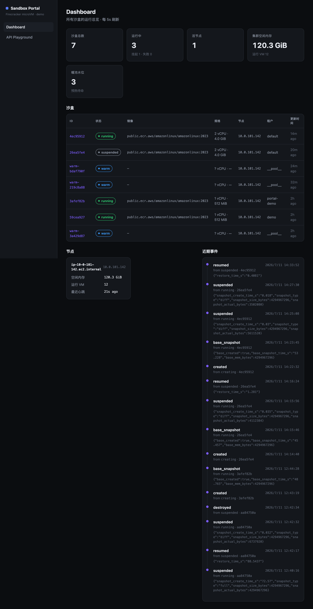
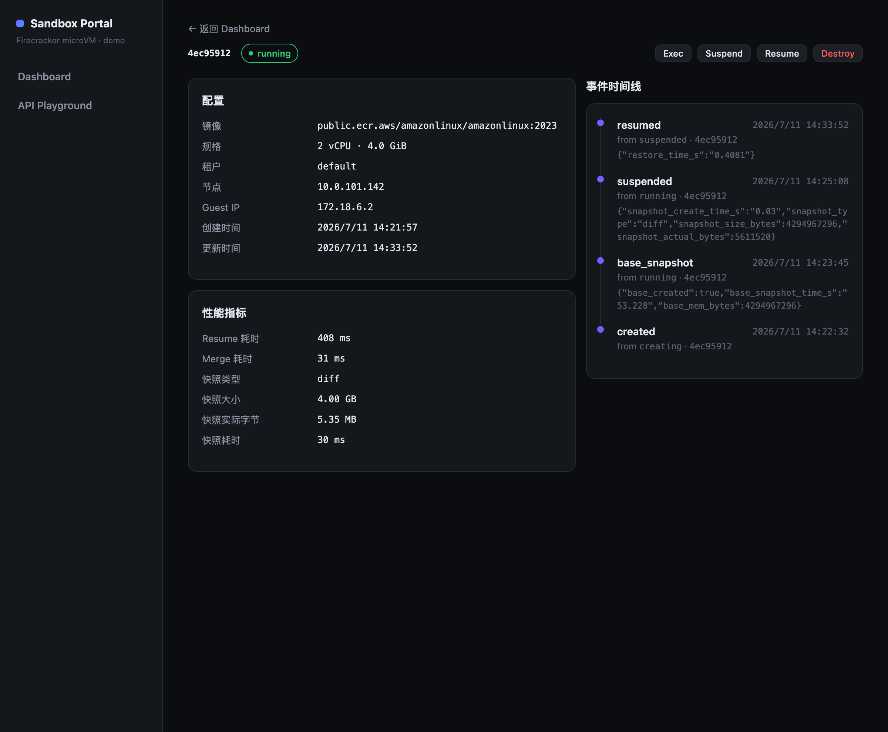

# AWS Self-Hosted AI Agent Sandbox Platform

> Build your own Fly.io-style Firecracker microVM sandbox on AWS — lower cost, full control, data stays in your account.

**中文** · [English](README.en.md)

---

### 项目简介

在 AWS 上复刻 Fly.io Firecracker microVM 架构，以更低成本、更高可控性运行 Claude Code 及各类 AI Agent。

- **真实 microVM 隔离**：每个沙盒运行在独立的 Firecracker guest 内核，与裸机行为完全一致
- **裸 Firecracker 后端**：node-agent 直管 microVM（jailer/tap/snapshot），成本优先；快照落持久状态 EBS（**不经 S3**），跨机恢复靠 EBS 卷幸存 + detach/attach（见下方"快照落盘与跨机恢复"说明）
- **快照驱动成本控制**：空闲沙盒快照挂起释放内存，访问时 ~1.2s 恢复
- **Fly Machines 风格 API**：create/wait/suspend/resume/exec/locate，幂等键、乐观锁、capability 模型
- **凭据零进沙盒**：Bedrock 凭据仅在 LiteLLM Pod 的 IRSA 角色，沙盒永远看不到真实 key

### 适用场景

| 场景 | 说明 |
|---|---|
| **Claude Code** | fork/exec 密集、文件监听重、嵌套进程 — microVM 保障与裸机一致的行为 |
| **OpenClaw / Hermes** | 会话式智能助理，需多租户隔离、按需扩缩 |
| **OpenAI Codex / 代码生成 Agent** | 任意代码执行，VM 级安全边界，防逃逸 |
| **长程 Agentic 任务** | 任务暂停恢复、工作流中断续跑、快照持久化 session 状态 |
| **SaaS 沙盒服务** | 向终端用户暴露隔离执行环境，多租户、按量计费 |
| **CI/CD 沙盒** | 隔离的构建/测试环境，npm install / docker build / 任意端口服务 |

### 控制台 Portal（Demo Dashboard）

一个轻量级的 E2B / Fly.io 风格控制台（[`portal/`](portal/)），用于快速演示与观测沙盒平台：全局总览
所有沙盒状态、节点水位、暖池水位与事件时间线，并可直接在 API Playground 里跑 create / suspend / resume /
exec / destroy，实时看到每次调用的响应与耗时。**纯本地运行**（`npm run dev` + `kubectl port-forward`），
详见 [portal/README.md](portal/README.md)。

| Dashboard 总览 | 沙盒详情 + 性能指标 |
|---|---|
|  |  |

> 上图为真机截图（EKS + c6g.metal）：汇总卡片、沙盒表格（含状态徽章）、节点水位、事件时间线；
> 详情页展示完整 record 与快照/恢复性能指标（如 diff 快照实际仅写 5.35 MB、恢复 408 ms）。

### 核心优势

#### 1. 裸机保真度（microVM 不是容器）

```
guest kernel: 6.18.28   ≠   node kernel: 6.1.172   ✅ 真独立内核
nproc: 3 (guest 配额)   ≠   宿主: 64              ✅ CPU 视图隔离
inotify 配额: 独立                                  ✅ 密集容器不会耗尽
root 可绑 80 端口、dnf 装包、嵌套 docker            ✅ 完整 root 无 seccomp 裁剪
```

#### 2. 成本控制：快照 = 成本杠杆

**最小配置月费（us-east-1，1 台 c6g.metal）：**

| 资源 | 单价 | 月费（730h） |
|---|---|---|
| c6g.metal（64vCPU/128GiB）**spot**（本平台目标模式）| ~$0.67/hr（us-east-1a 实时，约按需 29%）| **~$486** |
| c6g.metal 按需（对比基线）| $2.304/hr | ~$1,682 |
| EKS 控制面 | $0.10/hr | ~$73 |
| DynamoDB（PAY_PER_REQUEST）| 按写入量 | <$1 |
| 持久状态 EBS（gp3 400GB / 4000 IOPS / 1000MB/s，每节点一块，存内存快照）| $32 容量 + $5 IOPS + $35 吞吐 | ~$72/节点 |
| **合计（按需）** | | **~$1,828/月** |
| **合计（按需 + Savings Plan ~42% off，仅计算）**| | **~$1,122/月** |
| **合计（spot + 快照回收，本平台目标模式）** | | **~$632/月** |

> **spot 是本平台的核心成本模型**：c6g.metal spot 约为按需的 ~29%（实测 us-east-1 各 AZ $0.65–$0.74/hr，2026-07 查询），
> spot 被回收时靠快照疏散 + 跨机恢复保住内存状态（见下方 50 满载实测）。**spot 价格实时浮动**，以实际报价为准。
> 若不用 spot，按需可购 1 年期 Savings Plan 降约 42%。实际价格请以 [AWS Pricing Calculator](https://calculator.aws) 为准。

**承载能力与摊算成本（单台 c6g.metal，128 GiB）：**

| 运行模式 | 每沙盒内存 | 可承载沙盒数 | 摊算成本（按需） |
|---|---|---|---|
| 24×7 活跃工作集 | 1.5 GiB | ~75 个 | **~$23/沙盒·月** |
| **快照空闲回收** | ~50 MB（空载驻留）| **400+ 个** | **~$4/沙盒·月** |
| Savings Plan + 快照回收 | — | 同上 | **~$2–3/沙盒·月** |

- **resume 延迟 1.2s 实测**，用户无感知，快照挂起对用户透明
- 单台机器即可支撑小规模 SaaS，多台横向扩展线性增长（节点间无共享状态）

> **超卖（vCPU/内存 Overcommit）可进一步摊薄成本：** Firecracker microVM 支持 vCPU 超售——空闲沙盒几乎不消耗 CPU，活跃沙盒又是突发型负载。实测空载每 VM 实际驻留仅 ~50 MB（远低于分配的 1.5 GiB），这意味着可以按"分配值"超配、以"实际驻留"来装箱。结合快照空闲回收，实际可承载的沙盒数远高于内存物理限制所推算的数字，每沙盒摊算成本可以进一步降低。具体超售比例取决于业务负载特征，建议通过压测确定。

> 与 Fly.io 的详细成本对比（1000 沙盒场景，含带宽与非计算费用分析）见 **[docs/cost-comparison.md](docs/cost-comparison.md)**。

#### 3. 暖池（Warm Pool）：create 永远秒级，冷启动对用户透明

冷建一个 microVM 要造 rootfs（CoW 复制）+ 建 tap 网络 + boot guest 内核，即便 Firecracker 已经很快，仍有可感知延迟。**暖池把这段延迟提前预付**：后台预先造好一批空白沙盒、suspend 成内存快照落持久状态 EBS，`create` 请求来时直接 resume 顶上——把冷启动藏在用户视线之外。

```
后台补充 loop ─► 预造 N 个空白 VM ─► suspend 快照落持久 EBS ─► 标 pool_state=warm
                                                              │
create 请求 ──► 原子 claim 一个 warm ──► resume(~0.13s) ──► 改成真实 id ──► 201
                    │ 池空/抢输                （复用快照原节点）
                    └──► 回退冷建（driver.create）
```

- **claim resume ≈ 0.13s**（真机实测，FC Full 快照 load + tap）；`create` 体感恒定秒级，冷启动对用户透明
- **加速收益取决于业务镜像的冷启动成本**：空白 min-rootfs 的冷建本身就快（~0.17s，CoW + FC 微秒级 boot），暖池收益有限；暖池的价值在**冷建昂贵**时才凸显——rootfs 大、boot 要装依赖/起服务、guest 应用初始化慢（预装 node_modules、预热运行时）的真实业务镜像，此时冷建几秒~几十秒 vs resume 恒定 ~0.13s，才是数量级差异。**上线前请用真实镜像压测确定收益。**
- **原子领取无竞态**：`claim` 走 DynamoDB 条件写抢占（`pool_state=warm → claimed`），并发 create 不会领到同一个实例，抢输方自动回退冷建
- **自动补水**：后台 loop（默认每 30s）按水位补足 `WARM_POOL_SIZE`（默认 5）；多副本控制面下**只有 leader 补池**（复用 P0 的 leader 门控，不重复造）
- **优雅降级**：池空时透明回退冷建，功能不受影响
- 可调：`WARM_POOL_SIZE` / `WARM_POOL_REFILL_S` / `WARM_CPU` / `WARM_MEM_MIB`（实现见 `sandbox-api/warm_pool.py`）

> 暖池依赖 suspend/resume 快照能力。`GET /capabilities` 的 `warm_pool` 字段反映是否启用。
> 暖池已于 2026-07-07 真机 e2e 验证通过（含 resume 落原节点、vsock exec、池空降级），过程修复 4 个真机 bug，详见 **[docs/暖池-真机测试报告-2026-07-07.md](docs/暖池-真机测试报告-2026-07-07.md)**。

#### 4. API 开发者友好性

```bash
# 创建沙盒（幂等）
POST /sandboxes
{"image": "...", "cpu": 2, "mem_mib": 4096, "idempotency_key": "req-123"}

# 等待就绪
GET /sandboxes/{id}/wait?state=running&timeout=30

# 挂起（快照 + 释放内存）
POST /sandboxes/{id}/suspend   # → snapshot_type, restore_time（快照落持久 EBS）

# 恢复（同机 ~1.2s；快照读自持久 EBS，不经 S3）
POST /sandboxes/{id}/resume

# 执行命令
POST /sandboxes/{id}/exec
{"cmd": "npm test"}

# 端口暴露（vibe coding / web 预览）—— 任意端口,经反代访问沙盒内服务
ANY  /s/{id}/{port}/{path}   # → 反代进 guest;路径路由,支持多沙盒暴露同一端口;支持 WebSocket

# 文件上传 / 下载（base64 over exec,适合中小文件 ≤10MB）
PUT  /sandboxes/{id}/files?path=/root/app.py   {"content_b64": "..."}
GET  /sandboxes/{id}/files?path=/root/out.txt  # → {"content_b64": "..."}

# 自定义镜像 / rootfs 模板 —— create 时按 image 选不同根文件系统
POST /sandboxes  {"image": "web", ...}   # web 预设自带 demo 站点,开机自起 :80
GET  /admin/images                        # 可用镜像列表(供 Portal 下拉)
```

> **端口暴露**：`/s/{id}/{port}/` 用**路径**（非子域名）定位沙盒 → 天然支持多个沙盒暴露同一内部端口
> （两个沙盒都开 80 互不冲突）。链路 `NLB → ingress-nginx → 控制面反代 → node-agent → guest`，
> 先用 NLB 自带域名、零自定义 DNS。
> - **任意端口**（`ALLOW_ALL_PORTS`,默认开）：用户在 guest 内起在任何端口都能访问,无需预声明。
> - **WebSocket 透传**：Vite HMR / SSE / 交互式终端均可。
> - **交互式 Web Terminal**：Portal 详情页"打开终端"一键在 guest 内起 PTY-over-WebSocket 终端(xterm.js),无需重建 rootfs。
> - **文件上传/下载**：`PUT/GET /sandboxes/{id}/files?path=`(base64 over exec),Portal 详情页有拖拽上传/下载卡片。
> - **可选鉴权**（`EXPOSE_TOKEN`）：设置后访问需带 `?token=`。
>
> 启用见 [docs/deploy.md](docs/deploy.md) Step 6.5，设计见 [docs/端口暴露设计-firecracker.md](docs/端口暴露设计-firecracker.md)。

> **自定义镜像 / rootfs 模板**：`image` 字段选不同根文件系统模板(命名 rootfs 方案,非实时拉 OCI)。
> `build-rootfs-image.sh <name>` 预构建 `rootfs-{name}.tar.gz` → 节点造 `/opt/sbx/rootfs-{name}.ext4` →
> create `image={name}` CoW 之。内置 **`web`** 预设(自带站点 + 开机自起 :80,端口暴露打开即见页面)。
> 非默认 image 自动跳过暖池走冷建;未构建的模板回退默认 min(不报错)。构建见
> [docs/deploy.md](docs/deploy.md) Step 1.6,设计见 [docs/自定义rootfs设计.md](docs/自定义rootfs设计.md)。

#### 5. 安全性
- VM 级隔离：每沙盒独立 guest 内核，无共享宿主内核泄漏
- 凭据零进沙盒：Bedrock 凭据只在 LiteLLM IRSA
- Bearer token 认证，多 key 支持多租户
- 强制 IMDSv2（`http_tokens=required`）：阻断 SSRF 经 IMDSv1 窃取宿主机实例凭据

#### 6. 高可用编排（控制面自愈，非"手搓 POC"）

控制面无状态、状态全落 DynamoDB，配合一组 DynamoDB 原语实现生产级编排能力（对标 E2B 的中心化控制面，详见 [docs/编排层调研与改进路线.md](docs/编排层调研与改进路线.md)）：

- **reconcile loop（状态自愈）**：后台周期对账 DynamoDB 期望态 vs node-agent 实况；发现漂移（如节点/VM 消失但记录仍 `running`）自动标 `orphaned` 并回收泄漏资源，杜绝状态永久漂移。
- **leader 选举（多副本不打架）**：DynamoDB 条件写租约 + fencing token（rvn），控制面多副本下只有 leader 跑 reconcile/暖池补充；leader pod 挂掉后另一副本秒级接管。
- **节点心跳注册表（弹性发现）**：node-agent 每 30s 上报 `free_mem/vm_count/last_seen`，控制面按 `last_seen` 超时自动剔除死节点、`_pick_node` 从注册表选节点——不再靠硬编码 `FC_NODES`。
- **快照落盘强一致**：suspend 先同步确认快照已落持久状态 EBS、再释放 VMM 内存；落盘失败则恢复 VM 运行而非静默丢数据。保证不变式 **状态标 `suspended` ⟺ 持久 EBS 确有快照**。

> 上述能力均已 **真机验证通过**（EKS + c6g.metal，含 leader 故障转移、reconcile 漂移检测、快照落盘强一致），详见实测数据表。

---

### 与主流方案对比

| 维度 | 本方案（AWS 自建） | E2B | Fly.io Machines | AWS AgentCore |
|---|---|---|---|---|
| **隔离层** | Firecracker microVM | Firecracker microVM | Firecracker microVM | 容器（共享内核）|
| **裸机保真度** | ✅ 最高 | ✅ 高 | ✅ 高 | ❌ 容器行为偏差 |
| **自定义镜像** | ✅ 命名 rootfs 模板(预构建) | ✅ | ✅ | ❌ 受限 |
| **任意端口** | ✅ 通配符子域名 + 共享 NLB | ✅ | ✅ | ❌ |
| **24×7 长驻** | ✅ | ✅ | ✅ | ❌ 有 TTL |
| **快照 suspend/resume** | ✅ 实测 1.2s | ✅ | ✅ | ❌ |
| **凭据隔离** | ✅ LiteLLM IRSA（已落地）| ✅ | ✅ | N/A |
| **控制面自愈** | ✅ reconcile + leader + 心跳发现 | ✅ ~20s sync loop | ✅ 去中心化 flyd | ✅ 托管 |
| **数据主权** | ✅ 数据留 AWS 账号内 | ❌ 第三方 | ❌ 第三方 | ✅ |
| **K8s 生态集成** | ✅ 原生 | ❌ | ❌ | ❌ |

---

### 架构概览

```
┌─ EKS cluster ─────────────────────────────────────────────────────┐
│                                                                      │
│  托管节点组（系统节点）          c6g.metal 节点（沙盒）              │
│  ┌──────────────────────────┐      ┌───────────────────────────┐   │
│  │ sandbox-control-plane    │ HTTP │  Firecracker microVM       │   │
│  │ (Deployment, 2 副本,IRSA)│─────►│  node-agent DaemonSet      │   │
│  │  FirecrackerDriver       │◄─────│   ├ jailer / tap / snapshot│   │
│  │  WarmPool                │ 心跳 │   └ 每 30s 上报 nodes 表  │   │
│  │  Reconciler (leader-only)│      └───────────────────────────┘   │
│  │  无状态 → DynamoDB        │                                       │
│  └──────────────────────────┘                                       │
│         ↑ ingress-nginx (NLB)                                       │
│         api.sbx.<domain>  ←── 生产外部访问（POC 推荐 port-forward）  │
│                                                                      │
│  DynamoDB: sandboxes / events / tap-idx / nodes(心跳) / locks(leader)│
│  LiteLLM(Bedrock代理)                                                │
└──────────────────────────────────────────────────────────────────────┘
```

---

### 快速开始（Agent 部署指南）

> 将以下提示词复制给 Claude Code / Cursor / 任意支持代码执行的 Agent，即可引导完整部署。
> 完整步骤手册见 **[docs/deploy.md](docs/deploy.md)**。

```
你是一名 AWS 基础设施部署工程师，负责在 AWS 上部署一套 AI Agent 沙盒平台。

任务：完整阅读并按顺序执行 docs/deploy.md 中的所有步骤（Step 0 ~ Step 9）。
遇到错误时先排查根因，修复后再继续，不要跳过任何步骤。

⚠️ 关键注意事项（执行前必读）：
1. 认证安全：Step 6 必须传入 api_keys 和 litellm_master_key（用 openssl rand -hex 32 生成），
   不能留空——控制面无 key 时所有受保护接口返回 503。
2. rootfs 必须含 vsock agent：Step 1.5 的 min-rootfs（exec 走 vsock 通道），phase3 apply 需显式传 rootfs_s3_uri。
3. arm64 镜像：Step 5 的 build_and_push.sh 须在 arm64 机器上执行（M 系列 Mac 或 .metal 节点）。
4. 计费：c6g.metal 约 $2.3/hr，测试完成后立即执行 docs/deploy.md 中的【清理】步骤。

开始前先确认：
- AWS CLI 已配置（需要 EKS / EC2 / IAM / DynamoDB / ECR / S3 权限）
- 已安装 kubectl, terraform (≥1.5), helm, git
- c6g.metal vCPU 配额已申请（64 vCPU，默认配额不足需提前提单）

确认就绪后，请读取并执行 docs/deploy.md 中的所有步骤。
```

---

### 后期运维提示词

```
你是这套 AWS 沙盒平台的运维工程师。平台概况：
- EKS 集群 claude-sbx，c6g.metal 节点，裸 Firecracker microVM + node-agent DaemonSet
- 控制面：sandbox-system namespace，Deployment 2 副本
  外部访问：http://api.sbx.<domain>（ingress-nginx NLB）
- 状态存储：DynamoDB（claude-sbx-sandboxes / events / tap-idx / nodes / locks）
- 高可用编排：控制面 leader-only reconcile loop（对账自愈）+ node-agent 心跳注册表 + DynamoDB leader 锁
- 凭据隔离：LiteLLM（litellm namespace）持有 Bedrock IRSA，沙盒无凭据
- 快照：持久状态 EBS（base + Diff 增量内存快照），spot 疏散跨机恢复

常见运维操作：
1. 查看所有沙盒：curl http://api.sbx.<domain>/sandboxes?tenant_id=<id>
   或本地：kubectl port-forward -n sandbox-system svc/sandbox-control-plane 18000:80 &
2. 重启控制面：kubectl rollout restart deployment/sandbox-control-plane -n sandbox-system
3. 查看节点：kubectl get nodes -o wide
4. 查看 LiteLLM：kubectl logs -n litellm deployment/litellm --tail=50
5. DynamoDB 直查：aws dynamodb scan --table-name claude-sbx-sandboxes --select COUNT
6. 镜像更新：bash scripts/build_and_push.sh，然后 kubectl rollout restart deployment/sandbox-control-plane -n sandbox-system
7. 节点扩容：调整 phase3 metal 节点组 desired/min/max 并 terraform apply
8. 成本优化：批量挂起空闲沙盒
   for id in $(curl -s http://api.sbx.<domain>/sandboxes?tenant_id=all | python3 -c "import sys,json; [print(s['id']) for s in json.load(sys.stdin)['sandboxes'] if s['state']=='running']"); do
     curl -s -X POST http://api.sbx.<domain>/sandboxes/$id/suspend
   done

9. 查看活节点心跳：aws dynamodb scan --table-name claude-sbx-nodes --query 'Items[].{node:node_id.S,free_mem:free_mem_mib.N,last_seen:last_seen.S}'
   （last_seen 超 90s 的节点会被控制面判死、自动剔除出调度池）
10. 查看当前 reconcile leader：aws dynamodb get-item --table-name claude-sbx-locks --key '{"lock_id":{"S":"reconciler"}}' --query 'Item.{owner:owner.S,rvn:rvn.N}'
    （rvn 持续自增 = leader 在正常续租；owner 变更 = 发生了故障转移）
11. 排查孤儿沙盒：aws dynamodb scan --table-name claude-sbx-sandboxes --filter-expression "#s = :o" --expression-attribute-names '{"#s":"state"}' --expression-attribute-values '{":o":{"S":"orphaned"}}'
    （state=orphaned 是 reconcile 检出的漂移记录，reconcile_reason 字段说明原因）

监控关注点：
- node-agent 内存水位：kubectl exec -n sandbox-system daemonset/node-agent -- python3 -c "import urllib.request; print(urllib.request.urlopen('http://localhost:8002/health').read().decode())"
- DynamoDB 写入延迟：AWS Console → DynamoDB → Metrics → SuccessfulRequestLatency
- 节点利用率：kubectl top nodes
- LiteLLM 请求量：kubectl logs -n litellm deployment/litellm | grep "INFO:"
- reconcile 健康：控制面日志无 reconcile 异常 + locks 表 rvn 持续自增
```

---

### 本地冒烟测试

```bash
# 无需 AWS，本地直接跑
pip install "moto[dynamodb]" boto3 kubernetes
python3 sandbox-api/smoke_test.py
# 期望：29/29 PASS（含 leader 锁 / 节点注册表 / reconcile 漂移检测）
```

---

### 参与开发（Git Hooks，团队共享）

克隆仓库后**运行一次**，启用提交前的 AI code review + 文档自动同步：

```bash
./scripts/install-hooks.sh    # 设置 git config core.hooksPath .githooks
```

- hook 源文件在版本库的 `.githooks/`，**随 `git pull` 自动更新，无需重装**。
- git 出于安全不会自动改本地配置，故 `core.hooksPath` 需每位成员各自设一次（之后一直生效）。
- 临时跳过：`SKIP_CODE_REVIEW=1` / `SKIP_DOC_UPDATE=1 git commit`；全跳过：`git commit --no-verify`。
- 细节见 [.githooks/README.md](.githooks/README.md)。

---

### 实测关键数据

| 指标 | 实测值 | 环境 |
|---|---|---|
| microVM 启动延迟 | ~0.31s | c6g.metal，Firecracker v1.16 |
| 快照 resume 延迟 | **~0.13s（同机 Full 快照 load）** | 暖池默认落原节点走同机路径；跨机走持久 EBS 迁移（见下方 50 满载实测）|
| 空载驻留内存 | ~50 MB/VM | 512 MiB 分配 |
| 单机最大并发 | 60 VM（测试截止，未到上限）| c6g.metal 128 GiB |
| npm install 耗时 | 18s（JuiceFS）/ 4s（本地 ext4）| 7160 文件，8 依赖 |
| LiteLLM → Bedrock | ~1-2s | claude-haiku-4-5 |
| 冒烟测试通过率 | **26/26（ALL PASS）** | moto mock，`sandbox-api/smoke_test.py` |
| FC exec（vsock 通道） | rc=0，guest kernel 5.10.223 | c6g.metal，exec 在 microVM 内执行 |
| FC suspend→resume | 快照落持久 EBS（不传 S3）/ resume 亚秒 | 内存态跨快照精确保留（数据保真已验证）|
| 节点心跳注册 | 每 30s 写 nodes 表，`_pick_node` 从表选点 | 替换硬编码 FC_NODES |
| leader 故障转移 | 删 leader pod → 另一副本秒级接管（owner 转移）| DynamoDB 条件写租约 + rvn |
| reconcile 漂移检测 | running 但 runtime 消失 → 自动标 orphaned | 后台 20s 对账 |
| 快照落盘强一致 | suspend=suspended ⟺ 持久 EBS 确有快照 | 落盘确认后才释放内存 |

> P0 编排加固（reconcile / 心跳 / leader / 快照落盘强一致）已于 2026-07-07 真机验证通过，设计与借鉴来源见 [docs/编排层调研与改进路线.md](docs/编排层调研与改进路线.md)。

---

### 50 满载 sandbox 的 spot 疏散 + 跨机恢复实测（持久 EBS + Diff 增量快照）

> 核心场景验证：spot 节点收到回收通知 → 在 120s 窗口内把 50 个满载沙盒的**内存状态**快照到
> **持久 EBS**（Diff 增量，不传 S3）→ spot 死后卷幸存 → 迁移到另一节点批量恢复、内存精确续上。
> 环境：c6g.metal × us-east-1a（单 AZ），单块 gp3 1000MB/s 状态卷，每个沙盒灌到 ~1.2GB 常驻内存（模拟满载）。

| 环节 | 实测 | 说明 |
|---|---|---|
| **疏散（suspend，关键路径）** | 50/50 全 Diff，**墙钟 79.7s** | < 120s ITN 窗口，余量 ~40s；Diff 写盘 65.7GB（avg 1.3GB/个）|
| **状态卷迁移** | detach → attach 到新节点 ~数秒 | `DeleteOnTermination=false`，spot 强制终止后卷幸存（数据 md5 一致，已验证）|
| **跨机恢复（resume）** | 47–50 成功，**内存精确续上** | 恢复后 `FILL-*` 内存标记原样命中；P1 经 vsock 下发 ARP 刷新，`net_fix_ok` 100% |
| **resume 并发限流** | 并发 ~12–15 最优，50 个 ~33s | 单卷 EBS 带宽 ~15 并发饱和；`RESUME_CONCURRENCY`（默认 12）避免 merge I/O 打爆 |

**满载安全密度定论（单机单卷）**：**~50 个**（疏散 84.8s / 余量 35s + 内存 available 56G，双约束都舒服）；
60 个勉强（余量 15s）；70 个超窗（127s）。要更高密度需提高 EBS 带宽（多卷 / io2）或降低单沙盒内存占用。

> 关键正确性修复：resume 无条件把 Diff 合并到 base 再 load（干净页在 Diff 里是空洞，直接 load 会静默损坏内存）。
> 完整设计、实测数据与踩坑见 **[docs/firecracker-ebs-diff-design.md](docs/firecracker-ebs-diff-design.md)**。

#### 快照落盘与跨机恢复（现状说明，务必先读）

为避免与实现产生误解，明确当前边界：

- **快照只落节点本地的持久状态 EBS（`/var/lib/sbx/{id}/snap`），不经 S3。** suspend / spot 疏散全程不上传 S3；
  `snapshot_s3` 字段恒为空。跨机恢复依赖的是那块 `DeleteOnTermination=false` 的状态卷本身幸存、再 attach 到新节点，
  **不是从 S3 下载快照**。
- **代码里的 S3 兜底路径当前是"空转"的**：resume/`op_resume` 仍保留了"本地无快照则从 `s3_prefix` 拉"的分支，
  但因为没有任何路径把快照写进 S3（`upload_s3` 从不置真、`snapshot_s3` 恒空），这段兜底逻辑当前不会被触发。
  它是为"未来可选的 S3 归档/兜底"预留的接口，**不代表现在有 S3 副本**。
- **跨机恢复尚未全自动闭环**：node-agent 的 spot 回收自动疏散默认 **DRY-RUN**（只记录计划，不打快照），
  需设 `RECLAIM_AUTO_EVACUATE=1` 才真打快照落 EBS；而"节点死后自动 detach 卷 → attach 到新节点 → 批量拉起"
  这一步（Block 2 跨机编排）**尚未实现**。上文 50 满载"跨机恢复"实测中的卷 detach/attach 与批量 resume
  是**测试时手动/半自动编排**触发的能力验证，不是生产环境下的全自动流程。

> 一句话：**同机 suspend/resume 全自动、完全不碰 S3；跨机恢复的底层能力（EBS 卷幸存 + 快照精确续上）已实测，
> 但"自动侦测 spot 回收 → 自动搬卷 → 自动拉起"的编排闭环还没做完。**

---

*本项目是生产级参考实现，可作为在 AWS 上自建 Agent 沙盒平台的基础。*
